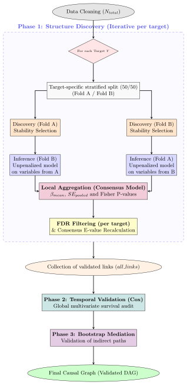

# StatApp - Causal DAG Analysis for COVID Data

This repository builds a **directed causal graph (DAG)** from clinical COVID data by combining:

- robust structure discovery (cross-fitting + stability selection),
- statistical inference (Fisher + FDR + E-values),
- temporal survival validation (Cox),
- bootstrap mediation analysis.

The pipeline exports both tabular outputs and publication-ready DAG figures.

## What this project does

The main pipeline lives in `src/reinforced_analyze_covid_data.py`:

1. Loads and cleans `data/combined_covid_data.csv`.
2. Runs level-wise causal discovery (cross-fitted DML logic).
3. Aggregates significance by original causal variable (not per dummy level).
4. Audits survival links with a Cox model.
5. Runs bootstrap mediation on prioritized clinical mediators.
6. Exports structured links to `data/reinforced_causal_dag_structured.csv`.

The DAG rendering pipeline is in `src/reinforced_make_dag.py`:

- statistical pruning (p-value, stability, E-value),
- chronological edge orientation,
- weighted transitive reduction,
- final DAG export as PNG/SVG.

## Global pipeline
<picture>
  <source media="(prefers-color-scheme: dark)" srcset="./ressources/schema_dark.svg" width="80%">
  
</picture>

## Project structure

```text
src/
  preparation_covid_data.py            # Build combined dataset from Excel sheets
  reinforced_analyze_covid_data.py     # Main causal analysis pipeline (phases 0-4)
  reinforced_make_dag.py               # DAG pruning + rendering
  RECAP_CHANGEMENTS_REINFORCED_ANALYZE.md

data/
  combined_covid_data.csv
  reinforced_causal_dag_structured.csv
  reinforced_causal_dag_pruned.csv
  reinforced_causal_dag_final.png
  reinforced_causal_dag_final.svg
```

## Installation

1.  Install `uv`:

    ```shell
    pip install uv
    ```

2.  Create a virtual environment and download packages:

    ```shell
    uv sync
    ```

3.  Activate the virtual environment:

    -   On Windows:

        ```shell
        .venv\Scripts\activate
        ```

    -   On macOS/Linux:

        ```shell
        source .venv/bin/activate
        ```

## Run

1) Prepare or refresh the combined dataset:

```powershell
python .\src\preparation_covid_data.py
```

2) Run the full causal analysis pipeline:

```powershell
python .\src\reinforced_analyze_covid_data.py
```

3) Generate the final DAG artifacts:

```powershell
python .\src\reinforced_make_dag.py
```

## Main outputs

- `data/reinforced_causal_dag_structured.csv`: structured links produced by the analysis pipeline.
- `data/reinforced_causal_dag_pruned.csv`: links after DAG pruning/orientation/reduction.
- `data/reinforced_causal_dag_final.png`: final DAG image.
- `data/reinforced_causal_dag_final.svg`: vector version of the final DAG.

## Notes

- The project targets Python `>=3.12` (`pyproject.toml`).
- Stability and convergence depend on bootstrap and model hyperparameters.
- Mediation outputs should be interpreted with clinical context.
